# FACTORED DATATHON 2024 - BIFROST ANALYTICS

## CHALLENGE 

 Your mission, should you choose to accept it, is to uncover critical insights from global events that allow for early intervention and strategic planning, ultimately helping businesses and organizations navigate complex and volatile environments.

 You will dive deep into the vast and dynamic dataset provided by the Global Database of Events, Language, and Tone GDELT. This year, we're presenting two challenges, designed to test your data skills and creativity.

[GDELT](https://www.gdeltproject.org/)

#### NEWS ANALYSIS

 Create a summary of news for a specific period picking topics such as Social, Political, and Economical.You should use Natural Language Processing (NLP) techniques to summarize the most relevant news for a topic of your interest in a specific timeframe. General guidelines that will help with the analysis are:

● Avoid using fake news as input, so you should be able to identify them.
 
● Minimize Political Polarization, it should be more focused on facts than opinions.
 
● Include the geographical and time dimensions within the analysis.
 

Your task is to synthesize vast amounts of news data into insightful summaries that capture the essence of current events, helping stakeholders make informed decisions based on reliable and unbiased information.

Goal: Create insightful, unbiased summaries of current events to aid decision-making.

#### RISK ASSESSMENT 

 Explore Global Trends and Conduct Risk Assessments across Social, Political, and Economic Domains.You should search and uncover anomalies that enable you to detect early signs of political unrest, armed conflicts, economic crises, or disease outbreaks. The insights enable proactive decision-making and risk mitigation strategies. General guidelines that will help with the analysis are:

● Assessing how Social and Political Risks (News) influence Economic events (Flagged Events).
 
● Predict negative sentiment in Economic events based on Social and Political news.
 
● Choose one topic—Politics, Social, or Economics—to understand and predict patterns for deteriorating situations in different geographies.
 
● Setup alerting mechanisms with possible signs of anomalies.
 

Goal: Provide early warning insights and predictions to aid in risk mitigation for businesses and organizations facing social, political, and economic uncertainties.

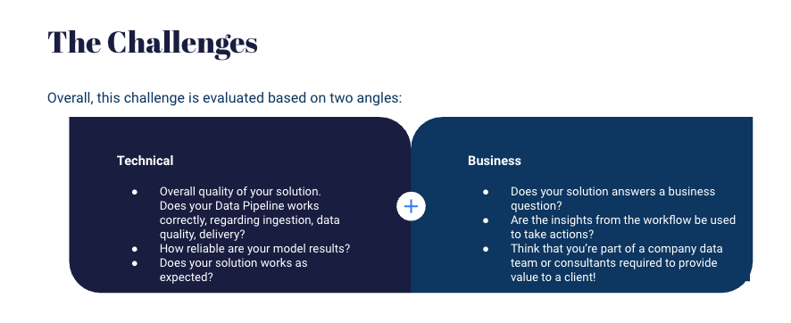

### 1. DATA ARCHITECTURE

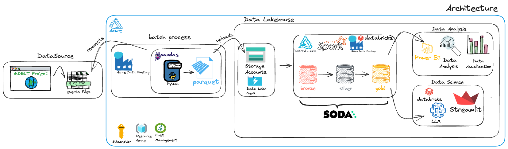

 The approach that Bifrost Analytics used to provide insights from the data source was creating a Data Lakehouse Architecture Solution. 
    As the source of GDELT events was just updated daily, characterized a architecture just for a batch process. 

#### BATCH PIPELINE

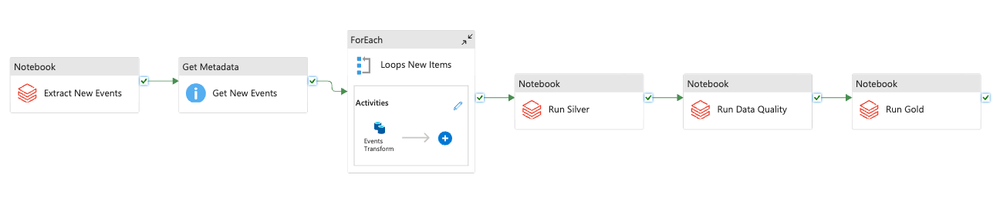

We've developed a Python application to handle batch processing of global events data sourced from the GDELT Project. To automate this process efficiently, we utilized Azure Data Factory (ADF), a cloud-based data integration service from Microsoft Azure, which gives us complete control over our data pipelines for seamless automation of ELT and ETL workflows. We set up a Data Lake Gen2 within our Storage Account, enabling hierarchical namespaces to organize the file structure. To optimize storage and performance, we converted the original CSV files into Parquet format and stored them in a container within the Storage Account.

We integrated Databricks with an Azure Storage Account, setting up a Data Lake Gen2 to handle our data storage needs. The Data Lakehouse architecture follows a layered approach to ensure data quality and efficient processing. Inside Databricks, we leverage Delta Lake, an open-source storage layer that brings ACID transactions and scalable metadata handling to Apache Spark - the distributed processing of data, ensuring high performance and scalability. We structured our data into Bronze, Silver and Gold Layers. While maintaining data quality throughout the entire process

This approach enabled us to provide Data Scientist and Data Analyst with access to high-quality, readily available data to drive meaningful decisions, discoveries and valuable insights.

 

#### 1.1 DATA ORIGIN 

<b>A Global Database of Society </b>

 Supported by Google Jigsaw, the GDELT Project monitors the world's broadcast, print, and web news from nearly every corner of every country in over 100 languages and identifies the people, locations, organizations, themes, sources, emotions, counts, quotes, images and events driving our global society every second of every day, creating a free open platform for computing on the entire world. 

### 2. DATA QUALITY

 With [Soda](https://www.soda.io/) we could be able to deliver trust data. During the process we discovered some inconsistences throught this wonderful tool.
 ##### 1. Percentage of Duplicate news URL: 
 

 Thought this warn check we created an incident and discovered that some URL were duplicated since the origin, but in the others fields the data was different, so it wasn't a duplicated value, but some news that included different types of Actors, the GlobalEventID was different, besides others fields. It was possible to discover that 14,8% of gdelt events was with the same link (almost 526k records).

 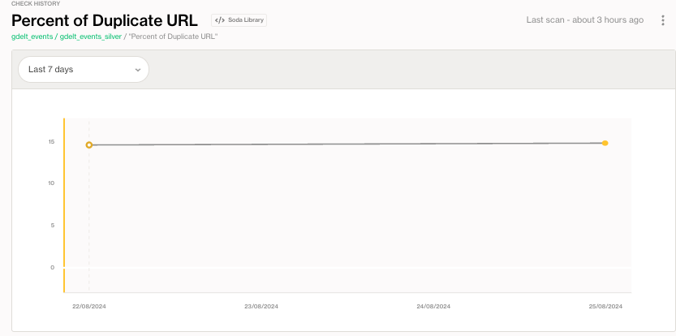

 ##### 2. Schema Check: 

  Thought this fail check we were able to see if the schema had new columns added or changed the type, and always passed with success.

 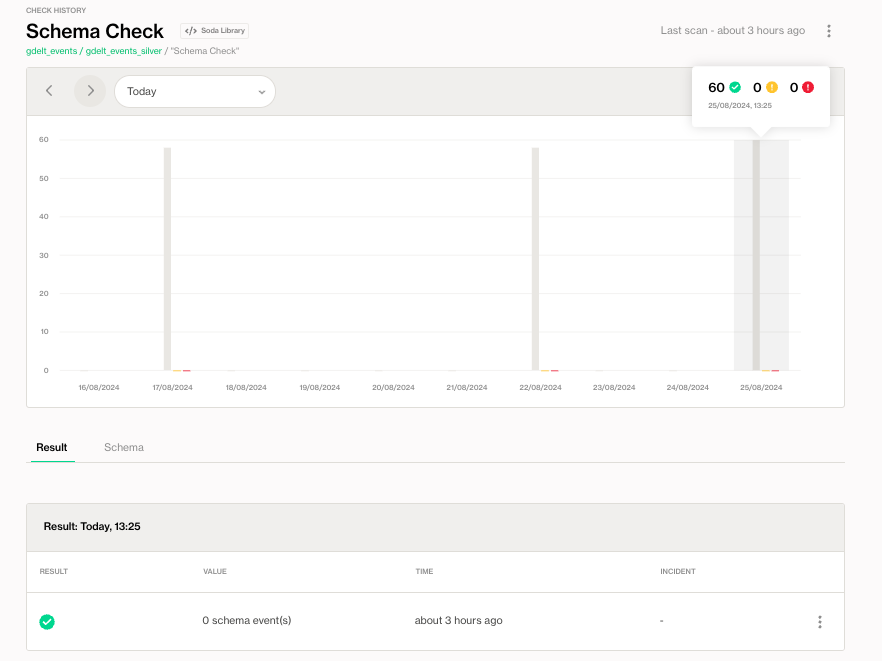

 ##### 3. Duplicated Events: 
 

  Thought this check we were able to see if we had duplicated GlobalEventIds, with means duplicated events, and we hadn't.

 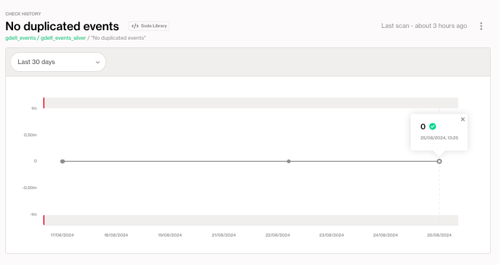

### 3. DATA SCIENCE: 

 #### Modeling 

 The modeling part aims to predict the importance and impact of a news event in the next time unit. We treat news as a timeline of events, and the questions we want to answer with the modeling is:
 What will be the next event? 
How will it be?
Given a timeline of events about some topic in economics like fees, our in politics like election, what is the likely outcome?
We wanted to use both classical machine learning and Gen AI to address that.

 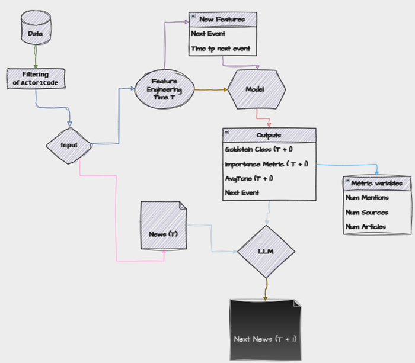

 We train the model with input at time T to predict time T+1.  The pipeline is:
 
● Data: The raw data about news events, including the text, date, source and importance metrics..
 
● Filtering of Actor1code: We decide to focus just on United States.
 
● Feature Engineering and Selection: This step transforms the data into a format that can be used by the model. We include features like the number of mentions, sources, and articles, as well as the Goldstein Class, Importance Metric (the sum of NumArticles, NumSources and NumMentions) and AvgTone.
 
● Model: The model uses the features at time T (present) to predict the next event (T+1), including the Goldstein Class, Importance Metric and  AvgTone.
 
● Metric Variables: The output of the model includes the predicted metric variables for the next time unit.
 
● LLM: This step integrates a large language model (LLM) to understand the context of the news event and predict the next event news based on the predicted metrics.
 
● Next News: The final output of the model is the predicted news event at time T+1.
 
This model can be used to help journalists and news organizations understand the impact of news events and predict the future trajectory of news stories.

### Deepening the Explanation 

#### **1. Data Preprocessing and Feature Engineering**

##### **1.1 Data Sorting and Feature Creation**

- **Sorting by Date**: The initial dataset is sorted chronologically by the columns `Year`, `Month`, and `Day`. This ensures that time-dependent features and subsequent values (`goldstein_next`, `avgtone_next`, and `combined_next`) are accurately aligned.
  
- **Combined Metric Creation**: A new feature, `CombinedMetric`, is generated by summing the values of `NumMentions`, `NumSources`, and `NumArticles`. This composite feature represents the overall significance of an event based on its media coverage.

##### **1.2 Removing Low Variance Features**

- **Threshold-Based Filtering**: Columns where more than 90% of the values are identical are considered low variance and are removed. This helps to reduce noise and prevent overfitting, as such features contribute little to model learning. The columns `Actor1Geo_Fullname`, `Actor2Geo_Fullname`, `ActionGeo_Fullname`, `SOURCEURL`, and `GlobalEventID` are specifically dropped, likely because they are irrelevant or redundant in the context of the analysis.

##### **1.3 Handling Categorical Data**

- **Categorical Columns Identification**: The categorical columns are divided into high cardinality and low cardinality based on the number of unique values. Columns with more than 200 unique values are treated as high cardinality.
  
- **Missing Data Handling**: Missing values in categorical columns are imputed with 'unk' (unknown) to maintain dataset integrity without introducing bias through imputation based on existing data distributions.

- **Label Encoding**: Low cardinality categorical features are label-encoded. This transforms categorical variables into numeric labels, which are essential for the models used.

- **Embedding Creation for High Cardinality Features**: For high cardinality features, embeddings are created using a `CountVectorizer` followed by `TruncatedSVD`. This reduces dimensionality and captures the essence of categorical features in a dense format, making them suitable for model training.

##### **1.4 Target Variable Creation**

- **Future Value Calculation**: Three target variables are created by shifting the `GoldsteinScale`, `AvgTone`, and `CombinedMetric` columns by one time step. These targets, `goldstein_next`, `avgtone_next`, and `combined_next`, represent the predicted future states of these metrics.

- **Null Value Filtering**: Rows where any of the target variables are null after the shift are removed to ensure that the models are trained on complete data, avoiding errors during training and improving prediction accuracy.

---

#### **2. Feature Selection and Model Training**

##### **2.1 RandomForestRegressor for Feature Importance**

- **Model Choice**: `RandomForestRegressor` is selected for its robustness and ability to rank features by importance through the `feature_importances_` attribute. This helps in understanding which features contribute most to the target predictions.

- **Top Features Selection**: The top 10 features, as determined by their importance scores, are selected for training the final model. This step reduces the feature space and improves model performance by focusing on the most predictive variables.

##### **2.2 DecisionTreeRegressor for Model Training**

- **Model Selection**: A `DecisionTreeRegressor` is then trained on the selected top features. Decision Trees are chosen for their interpretability and ability to capture non-linear relationships between features and the target variable.

- **Evaluation Metrics**: The model is evaluated using R² (coefficient of determination), MAE (Mean Absolute Error), RMSE (Root Mean Square Error), and MAPE (Mean Absolute Percentage Error). These metrics provide insights into the model's accuracy and predictive power.

- **Training and Results**: Separate models are trained for each target variable (`goldstein_next`, `avgtone_next`, and `combined_next`), with their respective selected features.

---

#### **3. Single Example Inference**

##### **3.1 Example Preprocessing**

- **Preprocessing**: A single example is preprocessed similarly to the training data, ensuring consistency in feature engineering and encoding.
  
- **Prediction Pipeline**: Each model (`model_gd`, `model_avgtone`, `model_combined`) makes predictions based on the preprocessed features. These predictions represent the expected future states of `GoldsteinScale`, `AvgTone`, and `CombinedMetric`.

#### **4. Large Language Model (LLM) Integration for News Generation**

##### **4.1 Prompt Design and LLM Interaction**

- **LLM Usage**: The predicted values are fed into a Large Language Model (LLM) to generate the next news article. The LLM, specialized in text generation, uses the context provided by the current and predicted metrics to craft a coherent and relevant news article.

- **Metrics Explanation**: The LLM is instructed to consider the provided and predicted metrics (`Goldstein`, `AvgTone`, `CombinedMetric`) to determine the tone, impact, and importance of the news. This ensures that the generated content reflects the data-driven predictions.

---

### 5. Points for Improvement

**GridSearch or Other Mechanisms to Find the Best Model**
With more time, implementing a GridSearch or RandomizedSearchCV strategy would be an excellent way to optimize model selection. These methods would allow a systematic search for the best hyperparameters within a predefined space, considering different models beyond the RandomForestRegressor and DecisionTreeRegressor. For example, we could consider models like Gradient Boosting Machines, XGBoost, or even regularized linear models, depending on the data's complexity and the need for interpretability.

**Hyperparameter Tuning**
Fine-tuning hyperparameters can significantly enhance model performance. This would involve setting parameters like tree depth, the number of estimators (for ensemble methods), and the number of components in SVD (for embeddings). Techniques such as Bayesian Optimization, which adjusts parameters iteratively based on an acquisition function, could replace traditional GridSearch, saving time and computational resources.

**Bidirectional LSTM Neural Network**
Given the temporal nature of the data, a natural evolution would be replacing tree models with a neural network. Specifically, a Bidirectional LSTM would be suitable as it can capture temporal dependencies in both directions (past and future). This neural network would have three outputs to predict the three targets (`goldstein_next`, `avgtone_next`, `combinedmetric_next`) simultaneously. Modeling with LSTMs would require transforming the data into time series, where features would be temporal sequences rather than point values.

**Better Handling of High Cardinality Features**
Currently, high cardinality features are handled using simple embeddings with CountVectorizer and TruncatedSVD. A more sophisticated approach could include specific embeddings for these features using techniques like Target Encoding, Leave-One-Out Encoding, or even embeddings learned by neural networks. These methods can better capture the nuances of high cardinality categories, especially in contexts where these categories have complex relationships with the target variables.

### 6. Evolution Points

**Event Relationship Mapping via Graph Structures**
Representing events and their interactions in a graph could provide richer insights for analysis and modeling. In a graph, nodes could represent events or actors, while edges would indicate interactions or relationships between them. This structure would allow applying graph learning algorithms like Graph Neural Networks (GNNs), which are excellent at capturing complex structural dependencies. This would be particularly useful for identifying interaction patterns between different actors in temporal and geopolitical scenarios.

**Creation of RAG for Each Actor1 x Actor2**
Creating a Retrieval-Augmented Generation (RAG) system for each combination of `Actor1` and `Actor2` would allow querying specific news histories and creating new articles with richer context. This would involve building a knowledge base where the history of interactions between specific pairs of actors is stored and used as additional context during new news generation. This system could be integrated into an LLM pipeline to generate texts that use not only the current context but also relevant historical references.

**Fine-Tuning LLM to Understand How Metrics Impact News**
Fine-tuning an LLM to better understand how metrics impact news is a crucial evolution point. A model specifically trained to capture the nuances of metrics like `GoldsteinScale`, `AvgTone`, and `CombinedMetric` in news generation could produce texts more aligned with analytical expectations. This would involve curating a training dataset that contains examples of how these metrics have impacted news content in the past, adjusting the LLM to recognize and reproduce these patterns with greater accuracy.

These improvement and evolution points represent a robust path to increasing the sophistication and predictive capability of the system, making it not only more accurate but also more adaptable to complex and multifaceted scenarios.

#### Streamlit App 

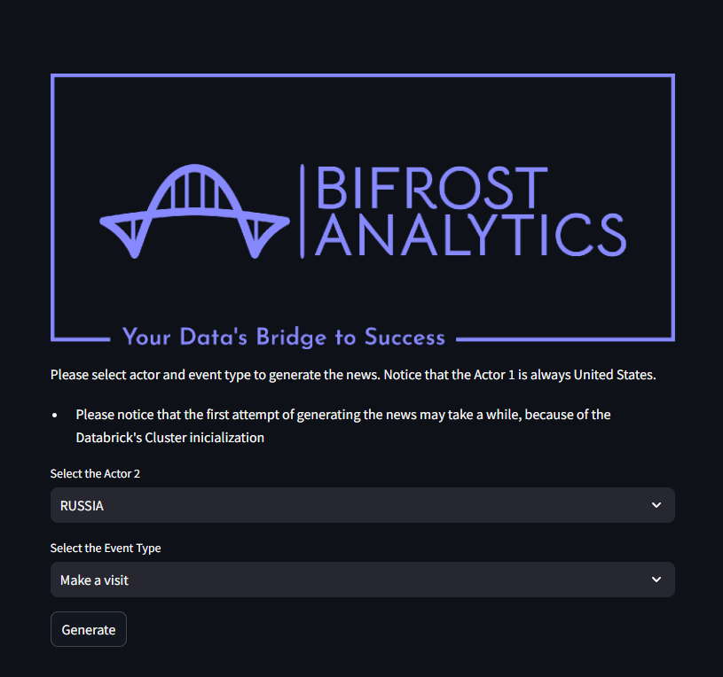

### 4. DATA ANALYTICS: 

#### Temporal and Geographic Analysis 

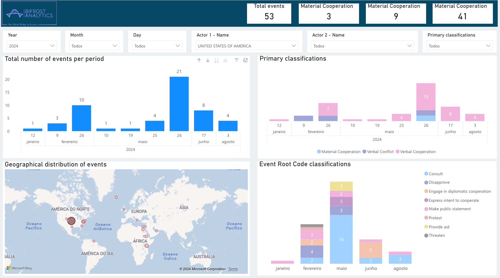

#### Actor 1 Analysis

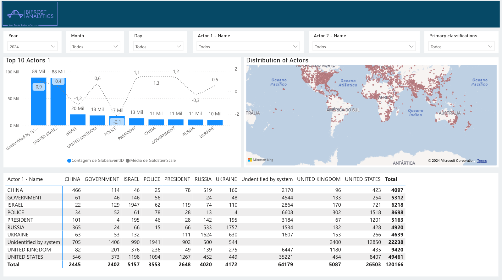

 

#### Analysisc of Actions and Impacts

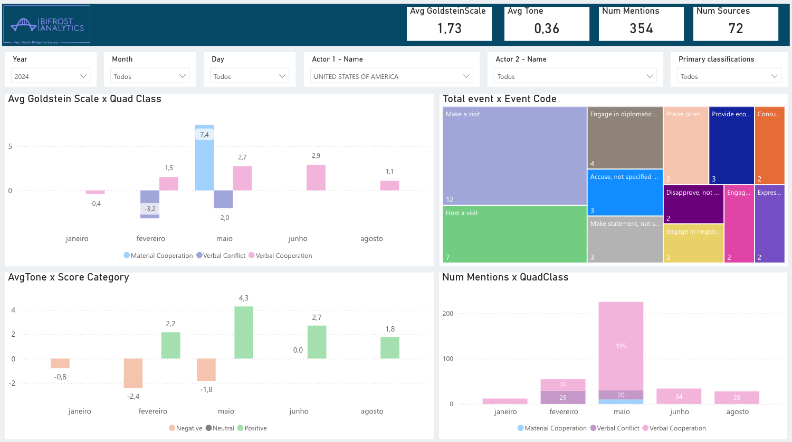

#### 4.1 Understanding the Scale of Global Events

##### 1. Global Events Over Time

 Historical analysis of global events provides a comprehensive view of their frequency, impact and evolution over time. 

##### 2. Geographical Location

 The geographic location of events is fundamental to understanding their contexts, regional influences and potential international impacts. 

##### 3. Identifying Patterns and Trends

 By analyzing temporal and geographic distribution, we can identify patterns and trends, revealing emerging scenarios and strategic opportunities.. 

#### 4.2 Understanding the Global Environment

Analyzing global events allows for a better understanding of the ever-changing global environment, providing valuable information for strategic decision-making

##### 1. Risk and Opportunity Identification

 By identifying patterns and trends, we can anticipate emerging risks and opportunities, enabling a more effective strategic response. 

### 5. TEAM 🇧🇷
 - Jessica Caroline Costa e Silva - Data Engineer | <b> [LinkedIn](https://www.linkedin.com/in/jessicaccostaesilva/) </b> | <b> [Github](https://github.com/jess197) </b> 
 - Luan José de Almeida Cardoso - Data Engineer | <b> [LinkedIn](https://www.linkedin.com/in/luanjosecar/) </b> | <b> [Github](https://github.com/luanjosecar) </b>
 - Lukas Mendes - Data Scientist | <b> [LinkedIn](https://www.linkedin.com/in/lukasjm/) </b> | <b> [Github](https://github.com/LukasJM) </b>
 - Gabrielle Moura - Data Analyst |<b> [LinkedIn](https://www.linkedin.com/in/gabrielle-moura-a3a782156/) </b> | <b> [Github](https://github.com/gabymoura) </b>

### 6. TECH STACK  
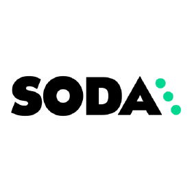

